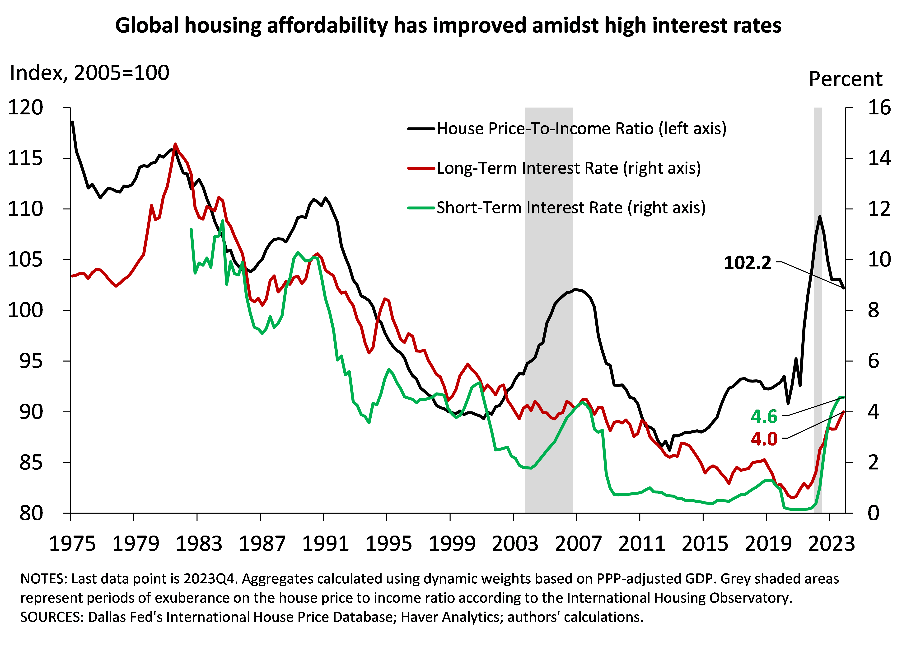

---
output:
  html_document: default
  pdf_document: default
---

```{r setup, include=FALSE}
knitr::opts_chunk$set(echo = FALSE, warning = FALSE, message = FALSE)
```

# Market Cool-Down Insights

<h3 style="color:grey;">2023Q4 IHO Global Housing Outlook</h3>

### Executive Summary

**Housing affordability improves amidst market cool-down and high interest rates.** As we wrap up 2023, the global housing market has seen a notable decrease in house prices, enhancing overall affordability compared to the previous year. This trend is driven by the efforts of central banks globally to target inflation, exerting downward pressure on property prices as financial conditions tighten. Simultaneously, strategic government interventions via tax benefits and financial support have alleviated some cost burdens for households. However, the ongoing challenges of sticky inflation, wage dynamics, slowing global activity, trade vulnerabilities, high debt levels, and geopolitical and technological uncertainties pose complex risks that could complicate the trajectory of the housing market going forward.  

<center>

```{r, out.width="70%", out.height="70%"}
  # adapt path
```
</center>

### Economic Indicators

<b>>Central banks’ tightening policies have been associated with changes in <a href="https://www.dallasfed.org/research/international/dgei/cpi" target="_blank">inflation rates</a> back to target.</b> Despite the slowdown in the hiking pace, the world’s <a href="https://www.dallasfed.org/research/international/dgei/policy" target="_blank">short-term interest rates</a> are at the highest level of the past 20 years, while <a href="https://www.dallasfed.org/research/international/dgei/ltrates" target="_blank">long-term interest rates</a> have also experienced similar increases. Weak global demand for goods weighed on activity leading to subdued global <a href="https://www.dallasfed.org/research/international/dgei/gdp" target="_blank">growth</a> in the last quarter of 2023. The exception is the US where a strong labor market is backing up the economy.  

### Global Property Prices and Trends

#### Decline in Global Prices

Global real property prices dropped by 0.9% showing continued and widespread declines. Since the peak of 2022Q2, real house prices have decreased continuously only with one short-lived rebound in 2023Q2. This quarter, Croatia and Denmark experienced positive real growth rates (+2.5% and +1.2%, respectively), whereas prices in Canada, Luxembourg, Norway, France, and Germany declined (-5.1%, -3.5%, -2.5%, -2.1% and -2.1%, respectively). In the US (-0.2%) and the UK (-0.25%) prices slipped slightly. Annual figures support the downward trend of real housing prices: global prices contracted by 3.6% in 2023 compared to an increase of 4.5% in 2022.

#### Enhanced Global Affordability

Global unaffordability as measured by the real house price-to-income ratio decreased by around 1%, signaling more affordable housing. In 2023Q4, real personal income increased slightly by 0.1%, which, coupled with falling property prices, made housing more accessible. From a country-level perspective, the outlook is similar: countries with the smallest increase in house prices experienced a greater increase in affordability, and vice versa. One of the few exceptions is Spain, where house prices dropped slightly (-0.2%) yet personal disposable income per capita decreased the most out of our pool of countries (-1.6%), resulting in lower affordability. On aggregate for the year 2023, housing became more affordable posting a 4% decline in the house price-to-income ratio. 

#### Mortgage and Rental Pressures

Amidst a tight monetary policy landscape, mortgage rates have climbed, adversely impacting the housing market and placing additional financial stress on households with existing adjustable-rate mortgages. This period of high interest rates is revealing the full extent of the impact of tighter financial conditions on the housing market more quickly in those countries with stronger transmission channels, especially as mortgage rates reset. This point has been noted recently in Chapter 2 of the International Monetary Fund’s <a href="https://www.imf.org/en/Publications/WEO/Issues/2024/04/16/world-economic-outlook-april-2024" target="_blank">World Economy Outlook for April 2024</a>. Real rental prices are accelerating relative to last quarter with Canada, Belgium, and Denmark experiencing the largest housing rent hikes (+1.6%, +1.3% and +1.1%, respectively). The US and the UK also experienced an uptick in real rents with quarterly increases of +0.95% and +0.7%. On the other side of the spectrum, the largest decrease in real rental prices was recorded in the Republic of Korea with almost a 1% drop.


### Selected Housing Government Policies and Regulations

**United Kingdom:** The Government introduced new regulations to ensure that Houses in Multiple Occupations (HMO) are considered a single dwelling for council tax, with the owner being the liable person. This regulation will simplify administration for landlords and reduce costs for tenants. 

**Canada:** The Government proposed legislation to temporarily remove the Goods and Services Tax (GST) on new rental construction and increase the GST rental rebate from 36% to 100% for apartment buildings, student housing, and senior residences. The purpose of the bill is to increase housing supply and affordability.

**Australia:** The Government passed the Help to Buy bill that establishes a shared equity scheme that assists low- to middle-income earners purchase new or existing homes. The Commonwealth contributes a portion of the equity (up to 40%) to reduce upfront costs for eligible buyers.

**Germany:** The Government decided to postpone both stricter building insulation criteria and replacing fossil fuel heating systems in new homes. This relaxation aims to address concerns from the construction industry regarding rising costs and a potential slowdown in housing construction.

