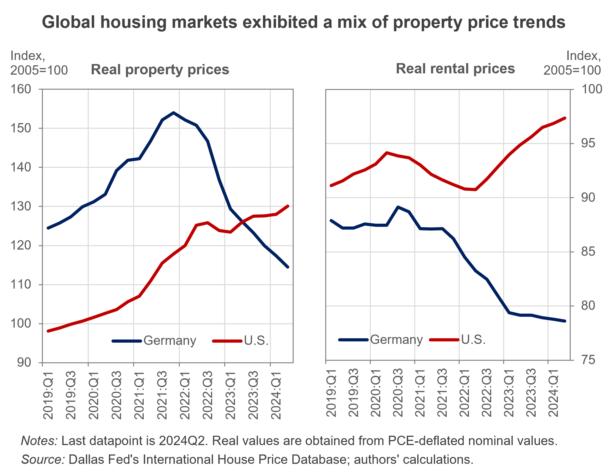

---
output:
  html_document: default
  pdf_document: default
---

```{r setup, include=FALSE}
knitr::opts_chunk$set(echo = FALSE, warning = FALSE, message = FALSE)
```

# Rising house prices clouded by an uncertain international environment

<h3 style="color:grey;">2024Q2 IHO Global Housing Outlook</h3>

### Executive Summary

**In the second quarter of 2024, global housing markets exhibited a mix of property price trends, with rising affordability challenges.** Central banks, including the ECB and the Federal Reserve, have begun lowering interest rates, but inflation prospects remain uncertain amid persistent price pressures and geopolitical tensions. While property prices surged in the U.S. and the U.K., China experienced significant declines, and affordability worsened in markets like the U.S., Spain, and Portugal. In contrast, falling property prices in Germany have improved housing affordability. Globally, rental prices continued to rise. Meanwhile, governments are introducing housing policies to address affordability and market stability.

<center>

```{r, out.width="70%", out.height="70%"}
  # adapt path 
``` 
</center>

### Economic Indicators

<b> Central banks in advanced economies have begun easing  <a href="https://www.dallasfed.org/research/international/dgei/policy" target="_blank">policy rates</a>, including the ECB and the Federal Reserve.</b> Emerging markets have adopted looser monetary policies, and many advanced economies are following suit. This easing is reflected in falling <a href="https://www.dallasfed.org/research/international/dgei/ltrates" target="_blank">long-term interest rates</a>. However, the future trajectory of policy rates remains uncertain, constrained by persistent <a href="https://www.dallasfed.org/research/international/dgei/cpi" target="_blank">inflation</a> in the services sector (housing in particular) and ongoing geopolitical risks. The escalation of conflict in the Middle East has increased oil prices, posing a threat to the current trend of declining inflation if elevated energy costs persist.

Global <a href="https://www.dallasfed.org/research/international/dgei/gdp" target="_blank">economic activity</a> continues to moderate, weighed down by weak manufacturing and slowing trade. In the U.S., while the labor market shows signs of cooling, growth remains resilient. Meanwhile, China's domestic economy continues to struggle due to its ailing property market. In response, Chinese authorities have implemented a series of stimulus measures aimed at reversing the slowdown and achieving their 5% growth target. However, substantial headwinds remain, and the effectiveness of these measures will be closely monitored.

### Global Property Prices and Trends

#### Higher house prices, with notable exceptions

Global real property prices rose by 0.6% compared to the previous quarter. The U.S. and the U.K. experienced notable increases, with real property prices rising 1.6% and 1.3% quarter-over-quarter (QoQ), respectively. In Spain, prices increased by 1.1% QoQ. However, China continues to face a sharp decline in residential property prices, which have been on a downward trajectory since their peak in 2021. China's property market remains under close global scrutiny due to its potential ripple effects on the broader economy.

Among other countries, Croatia saw the highest quarterly growth, with real prices rising by 2.3%, the only country in the sample exceeding 2%. The Netherlands, Israel, and Portugal followed closely, with price increases of 1.8%, 1.7%, and 1.7% QoQ, respectively. In contrast, Germany’s real property prices continued to decline, falling by 2.5% QoQ, while Japan saw a noticeable 2% QoQ drop.

Despite the diverse dynamics in global housing markets, the International Housing Observatory’s analysis indicates that the U.S. faces a significant risk of rekindling post-pandemic <a href="https://int.housing-observatory.com/dashboard" target="_blank">exuberance</a>. Other countries, including Croatia, Israel, and Portugal, are also displaying signs of renewed market overheating. However, there is no clear evidence of exuberance in price-to-income or price-to-rent ratios in the U.S. or in other countries for which data is available. Global housing markets appear to have entered a bifurcated phase: while some major economies, most notably the U.S., exhibit warning signs of a return to housing exuberance, others—such as Germany and China—are grappling with the aftermath of severe corrections that followed the collapse of their housing markets post-pandemic.

#### Affordability under pressure

Global housing affordability deteriorated in Q2 2024 after three consecutive quarters of improvement. The aggregate real house price-to-income ratio increased by 0.4% QoQ. In the U.S., affordability worsened by 1.3% QoQ due to slower growth in real personal incomes relative to real property prices. While affordability in the U.K. remained stable, rising real personal incomes in Spain were offset by higher real housing prices, resulting in a 0.2% deterioration in affordability—marking the second consecutive quarter of declining affordability in Spain.

Germany recorded the largest improvement in affordability, with a 2.7% QoQ gain, driven primarily by falling real property prices as its severe housing correction continues. In contrast, Portugal and the Netherlands saw the largest declines in affordability, with drops of 3.4% and 2.9% QoQ, respectively.


#### Rental prices remain high 

Real rental prices continued to rise in most countries, with the U.K. (+1.6%), Sweden (+1.5%), and Portugal (+1.2%) experiencing the largest increases. The U.S. and Spain saw more moderate rental price increases of 0.5% and 0.2% QoQ, respectively. On the other hand, the Republic of Korea and the Netherlands experienced the largest declines in rental prices, with decreases of 0.6% and 0.5% QoQ, followed closely by Luxembourg and Japan, which both saw declines of 0.4% QoQ.


### Selected Housing Policies and Regulations

**United States:** The U.S. government announced $5.5 billion in grants to promote affordable housing, community development, and homelessness assistance. This initiative aims to address the severe shortage of affordable housing and enhance community resilience.

**United Kingdom:** The U.K. government introduced a cap on annual rent increases for social housing at 7.7%, effective from April 2024 to March 2025. This is part of broader efforts to improve housing affordability amidst rising living costs.

**China:** Various cities, including Shanghai and Beijing, have introduced policies to stimulate the housing market, such as easing home-purchase restrictions and lowering down payments for second-home buyers. Additionally, the People's Bank of China and the National Financial Regulatory Administration reduced mortgage rates and minimum down payment requirements to boost the struggling property sector.

**Spain:** The Spanish government unveiled a plan to build 43,000 affordable rental homes as part of its Social Housing Promotion Facility Plan, supported by €6 billion in loans and guarantees. The initiative aims to increase public housing stock to 10% of the total housing supply, aligning with the European average.

**Germany:** Germany is grappling with a severe housing shortage, exacerbated by an underperformance in meeting its housing construction targets. The government's 2024 projection of 210,000 completed housing units falls short of the 400,000 annual target, which exacerbates the housing deficit that already stands at over 800,000 units. This shortfall particularly impacts low-income families and the middle class, with rising rents and homelessness as pressing issues.

**Australia:** The Australian government has set a target to build 1.2 million new homes over five years under the National Housing Accord, with $350 million allocated to support the delivery of 10,000 affordable homes. Matching commitments from state and territory governments will increase this number by an additional 10,000 homes.

