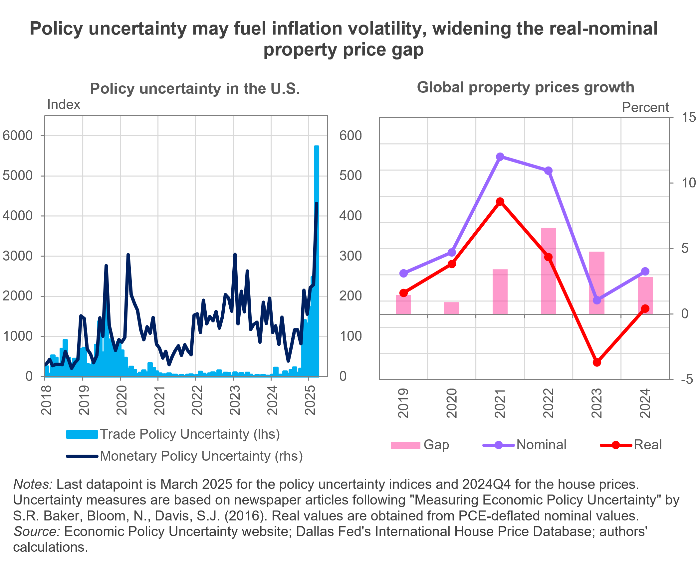

---
output:
  html_document: default
  pdf_document: default
---

```{r setup, include=FALSE}
knitr::opts_chunk$set(echo = FALSE, warning = FALSE, message = FALSE)
```

# Navigating uncharted waters: policy turmoil and property price instability

<h3 style="color:grey;">
  2025Q1<sup style="color:grey;">*</sup> IHO Global Housing Outlook
</h3>

### Executive Summary
  
**Economic uncertainty has emerged as an additional primary concern for housing markets, driven by heightened trade tensions and their potential impact on inflation outlook.** This uncertainty currently poses broad risks to housing stability, potentially worsening supply constraints and increasing pressure on both buyers and renters. Global housing markets experienced an uptick in nominal price growth in 2024, while the gap with real prices continued to narrow. Affordability improved slightly overall but remained a challenge in several regions; while rental prices continued to rise broadly, adding pressure to already tight markets. Policy responses were mixed, ranging from postponed housing initiatives in the U.S. to active regulatory reforms in Spain and China aimed at stabilizing markets and expanding access.
 

<center>

```{r, out.width="70%", out.height="70%"}
#knitr::include_graphics("E:/1_PROJECTS/IHO/IHO_25Q1/Chart_IHO2025Q1.png")  # adapt path
  
``` 
</center>

### Economic Indicators

**Recent waves of trade tariffs and the persistent threat of retaliatory measures have shaken global markets, leaving the geopolitical environment increasingly fragile.** The surge in protectionist policies has not only triggered widespread equity sell-offs but also instilled a pervasive sense of caution among investors. Amid concerns over a subdued economic outlook compounded by a fear of higher short-term inflation, <a href="https://www.dallasfed.org/research/international/dgei/ltrates" target="_blank">long-term interest rates</a> have been pushed higher. Also, the U.S. dollar has experienced modest depreciation relative to other major <a href="https://www.dallasfed.org/research/international/dgei/ner" target="_blank">currencies</a>. Most economies worldwide started to enter an <a href="https://www.dallasfed.org/research/international/dgei/policy" target="_blank">easing cycle</a> recently, with the expectation that  <a href="https://www.dallasfed.org/research/international/dgei/cpi" target="_blank">inflation rates</a> will ultimately stabilize on target. However, the prospect of elevated imported inflation poses a significant upside risk that could derail these efforts.

Ongoing trade tensions and the rise of multilateral tariffs are likely to disrupt global trade patterns, reshaping supply chains and altering how countries engage in international commerce. These changes could have significant effects on the pace of global <a href="https://www.dallasfed.org/research/international/dgei/gdp" target="_blank">economic growth</a>. In the U.S., robust domestic consumption continues to underpin economic progress, yet the short-term outlook clouds due to recent protectionist measures. Across Europe, growth remains moderate, though Spain stands out with a notably stronger economic outlook. In contrast, China’s growth momentum decelerates, with the impacts of tariffs prompting downward revisions in its growth forecasts. The increased cost of imported building materials along with a halt in construction investment due to uncertain economic growth can tighten housing supply, potentially putting upward pressure on property prices and rents.

### Global Property Prices and Trends

#### Despite a brief respite, house prices were up overall in 2024

Our latest data from 2024Q4 point to a global property price increase of 0.5% quarter-on-quarter (QoQ), leaving an annual growth of 3.25%. Compared to 2023, this growth rate is 2.2 percentage points (pp) higher. Accounting for the effect of inflation, real property prices slid -0.1% QoQ, posing the only decrease in real terms during 2024. Since 2022, the discrepancy between nominal and real property prices narrowed substantially (from a 6.6pp gap in 2022 to a 2.8pp in 2024), mainly due to the large reduction in inflation across countries.

Croatia, Ireland, and Luxembourg experienced the largest quarterly growth rates in nominal property prices (2.9%, 2.7%, and 2.6%, respectively). Nominal house prices continue to grow 2.1% QoQ in Spain, while in the U.K., property prices rose by 1.9% QoQ. The increase in the U.S. was more modest (+0.7% QoQ in nominal prices). Most notably, Canada presented the highest drop in both nominal and real house prices (-1.6% QoQ and -2.2% QoQ, respectively) for the second consecutive quarter. Japan followed with the second-largest decrease in nominal house prices (-1.3% QoQ).

Building on last quarter’s report, the latest analysis from the International Housing Observatory reveals very limited signs of exuberance in global housing markets. Portugal stands out as the only country currently exhibiting exuberance in both real house prices and the price-to-income ratio, while Croatia shows signs of exuberance only in real house prices. In contrast, the U.S. and Israel have exited the exuberant phase in real prices, and, as in the previous quarter, there remains no evidence of exuberance in price-to-fundamental ratios for either country. For all other monitored economies, the data do not indicate signs of renewed exuberance. These findings reinforce the narrative of a bifurcated housing market landscape with few countries showing isolated signs of overheating and the majority continuing to reflect more stable or subdued dynamics, highlighting the uneven and complex nature of the global housing trajectory.

#### Affordability sees a modest gain

Housing became slightly more affordable in the last quarter of 2024, with the house price-to-income ratio decreasing 0.15% QoQ. This was the first improvement in affordability in the previous two quarters led by stronger personal disposable income. Still, the annual improvement in affordability was more limited than in 2023 (+0.9% in 2024 vs +4.8% in 2023). Spain experienced the worst decline in affordability (-2.6% QoQ) with house prices outpacing personal income. As in the previous quarter, housing affordability in the Netherlands continues to be stringent (-2.3% QoQ). The U.S. experienced a slightly better affordability situation compared to the previous quarter (+0.1%) while in the U.K. there was an enhanced affordability of +0.6% QoQ. In line with their large drop in house prices, Canada’s affordability improved the most in 2024Q4 (+2.1% QoQ). 

#### Rental prices continue to climb without pause

Rents became more expensive for most of the countries. In Portugal, nominal rents grew at par with real rents by 1.2% QoQ. The U.K. and Canada saw a larger increase in nominal rents (+1.5% and +1.3% QoQ, respectively), but these increases were partly attributable to inflation. The U.S. experienced an increase of 0.9% in nominal rents whilst the real counterpart grew at a slower pace relative to the previous quarter (+0.3% QoQ). For Spain, nominal rents increased by 0.6% QoQ but in real terms, rental prices decreased the most among our analyzed countries (-0.5% QoQ).


### Selected Housing Policies and Regulations

**United States**: The Department of Housing and Urban Development (HUD), under the new government, has delayed the start dates of several finalized rules, including changes to the HOME Investment Partnerships Program and standards for manufactured homes. HUD also announced it will no longer move forward with two proposed rules: one aimed at reducing barriers to HUD-assisted housing and another promoting fair housing. These decisions pause key social housing initiatives, with unclear impacts on the broader housing market.

**China**: The new Government Work Report explicitly emphasized the need to stabilize the real estate market as part of the overall policy framework for 2025. It highlighted measures such as leveraging the real estate financing coordination mechanism, easing housing restrictions in a city-specific manner, and promoting urban redevelopment.

**Spain**: The Spanish government announced a package of 12 new measures to strengthen the right to housing. These included the transfer of over 3,300 state-owned homes and land to a new Public Housing Company, the creation of a new PERTE (Strategic Project for Economic Recovery and Transformation) for Housing, a public guarantee system for affordable rentals for those under 35, and a proposal for a 100% income tax exemption for landlords adhering to the new <a href="https://www.ine.es/dyngs/INEbase/en/operacion.htm?c=Estadistica_C&cid=1254736177110&menu=ultiDatos&idp=1254735976607" target="_blank">Housing Lease Reference Index</a>. A notable and controversial measure was the proposal to increase property transfer tax for non-resident non-EU nationals to up to 100% of the property's value. Moreover, the National Register for Short-term Rentals was introduced, requiring all short-term rental properties, such as tourist and seasonal apartments, to be registered with a unique identification number. Rental platforms were mandated to ensure that listed properties displayed this number. These measures aim to promote social housing and limit speculative investments in the property markets.

**United Kingdom**:  The planned reduction in the Stamp Duty Land Tax (SDLT) relief threshold for first-time buyers in England and Northern Ireland has come into effect. First-time buyers now pay no SDLT on properties costing £300,000 or less (before £425,000 or less). They pay 5% on the portion of the purchase price between £300,001 and £500,000 (£425,001 and £625,000). Also, no relief is available for properties costing over £500,000 (before £625,000). For non-first-time buyers, the nil-rate threshold (the point at which you start paying stamp duty) decreased from £250,000 to £125,000. The increased upfront costs of buying a home will likely reduce housing demand, pushing property prices down. 

<p style="color:grey; font-size:small; margin-top:0;">
<sup style="color:grey;">*</sup> We have updated the reference period of the IHO report (including the title) to align our description of the current market situation with the latest developments in housing policies and regulations. Accordingly, the 2025Q1 report is the next report after 2024Q3.
</p>
