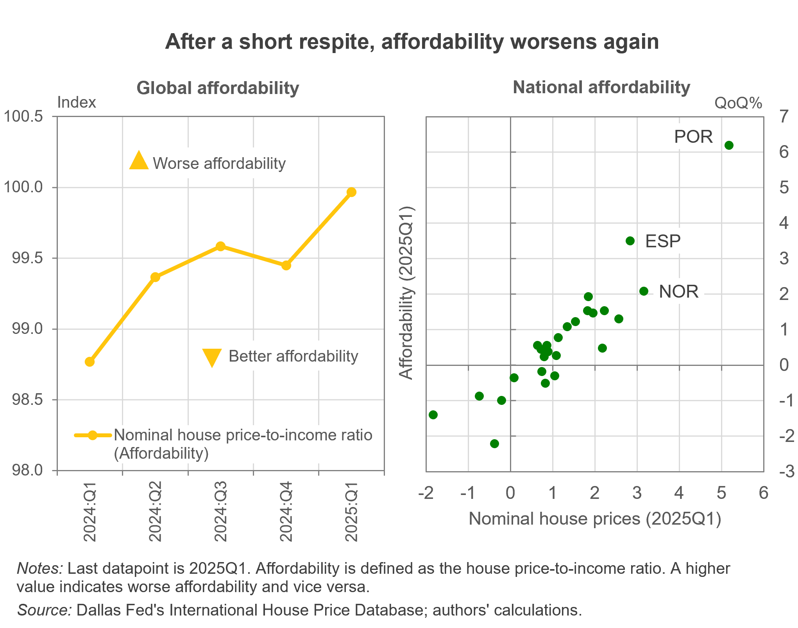

---
output:
  html_document: default
  pdf_document: default
---

```{r setup, include=FALSE}
knitr::opts_chunk$set(echo = FALSE, warning = FALSE, message = FALSE)
```

# Nominal Prices Up, Access Down: The Global Housing Market at a Crossroads

<h3 style="color:grey;">
  2025Q2 IHO Global Housing Outlook
</h3>

### Executive Summary

**Global housing markets remain in a fragile state, marked by continued nominal price increases and deepening affordability challenges.** In the first quarter of 2025, nominal house prices rose globally, yet remained broadly flat in real terms after adjusting for inflation. Affordability, after a brief pause, is worsening again, with Portugal, Spain, and Norway experiencing the sharpest declines as house prices outpaced income growth. Meanwhile, real rents declined in most markets, with notable exceptions in the U.K. and U.S., where both nominal and real rents moved higher. 

On the policy front, several governments have rolled out ambitious initiatives: the U.K. launched a new National Housing Bank; Portugal announced a large-scale supply expansion agenda; Germany extended rent control laws; and Spain implemented measures to curb speculative activity. In the U.S., changes at the FHFA and renewed debate over the future of Fannie Mae and Freddie Mac—key institutions supporting mortgage liquidity—could inject uncertainty into housing finance markets. As a result, investors and policymakers alike must navigate these choppy waters amidst a rapidly changing external environment characterized by rising policy complexity and localized risks.


<center>

```{r, out.width="70%", out.height="70%"}
# knitr::include_graphics("E:/1_PROJECTS/IHO/IHO_25Q2/Chart_IHO2025Q2.png")  # adapt path
  
``` 
</center>

### Economic Indicators

**Despite the temporary truce in trade tariffs, which improved global market sentiment and growth prospects, new announcements of protectionist policies could undermine confidence.** Increased volatility in trade flows and modest global economic <a href="https://www.dallasfed.org/research/international/dgei/gdp" target="_blank">growth</a> are anticipated, with <a href="https://www.dallasfed.org/research/international/dgei/cpi" target="_blank">inflationary</a> pressures requiring close monitoring. The Federal Reserve and the Bank of England held <a href="https://www.dallasfed.org/research/international/dgei/policy" target="_blank">policy rates</a> steady, whereas the European Central Bank cut rates.

Growth momentum is expected to improve in the near term, but may weaken later in the year due to an unstable geopolitical environment. In the U.S., the newly signed budget bill (OBBB) aims to stimulate the economy but could weigh on public finances. In Europe, the economy remains resilient despite subdued domestic investment amid ongoing uncertainty. China’s economy shows renewed momentum, although it remains vulnerable to potential escalations in trade tensions.

### Global Property Prices and Trends

#### House prices keep rising in nominal terms but stall in real terms

Global nominal property prices kept increasing by 1% quarter-on-quarter (QoQ) at the start of the year (2025Q1 data). Real prices were flat, indicating the rise was mainly driven by overall inflation. Portugal, Norway, and Spain recorded strong quarterly increases in both nominal and real terms: 5.2% (4.2%), 3.2% (2.4%), and 2.8% (1.4%), respectively.  The U.K. maintained 2% QoQ nominal price growth, and the U.S. registered a moderate 0.7% QoQ  increase. In contrast, Luxembourg and Italy were countries with pronounced house price drops. The declines become clearer when looking at the real prices, where prices fell by 2.8% QoQ in Luxembourg and 1.3% QoQ in Italy. Germany, Belgium, and South Korea followed with the same 1% decline QoQ.

According to the latest quarterly assessment from the International Housing Observatory, the absence of widespread exuberance in international housing markets has continued into the post-COVID period. Portugal remains the only country exhibiting exuberance in both real house prices and price-to-income ratios, indicating persistent valuation pressures. In contrast, Croatia, which previously showed exuberance in real prices alone, no longer meets the threshold this quarter. Israel and the U.S. continue to show no signs of exuberance across either metric. The broader picture reflects a fragmented and uncertain housing landscape, where the lack of exuberance is less a sign of stability and more an indication of limited evidence of widespread overheating in the housing market, with some localized vulnerabilities emerging.

#### Affordability worsens again

Global affordability deteriorated again this quarter, with the average house price-to-income ratio rising 0.5% QoQ. Unsurprisingly, Portugal, Spain, and Norway saw their affordability worsen the most in line with the observed house price surge (6.2%, 3.5%, and 2.1%, respectively, all QoQ). For the case of Portugal and Spain, the drop in quarterly nominal personal disposable income growth contributed to exacerbating the situation. In a similar way, affordability in the U.K. worsened by 1.5% QoQ, and in the U.S., the house price-to-income ratio rose 0.5% QoQ. Conversely, the biggest improvements in affordability were in Italy (2.2% QoQ) and Luxembourg (1.4% QoQ), where house prices also dropped the most. In Italy, more affordable housing was mainly driven by a robust increase in personal income.

#### Rent prices in real terms fall for most countries

Nominal rents rose by over 0.5% QoQ in most countries, largely due to inflation. In Portugal, nominal rents increased 1.3% QoQ, but real rents slipped –0.1% QoQ. Similar quarterly real rent declines were observed in Japan (–1.4%), Belgium (–1.1%), Spain (–0.9%), and Germany (–0.6%). The U.K. and U.S. bucked the trend, with rents rising in both nominal and real terms. Compared to the previous quarter, nominal rents accelerated in the U.K. (+1.7% QoQ) and held steady in the U.S. (+0.9% QoQ).


### Selected Housing Policies and Regulations

**United States**: Recent leadership changes and a board reshuffling at the FHFA—along with ongoing discussions about the future of Fannie Mae and Freddie Mac—highlight the potential for significant shifts in the structure of the U.S. housing finance market. Such changes could alter the availability and cost of mortgage credit and affect broader market dynamics.

**United Kingdom**: The U.K. government announced the creation of a new National Housing Bank, backed by £16 billion in public investment, with the goal of delivering over 500,000 new homes. Operated by Homes England, the initiative is designed to unlock up to £53 billion in additional private sector funding by offering low-interest loans and financial guarantees, particularly targeting small and medium-sized housebuilders. This move has the potential to significantly boost housing supply, diversify market participants beyond large developers, and address long-standing structural affordability issues in the housing sector.

**Spain**: Several laws relating to the housing market came into effect this quarter. The “Ley Orgánica 1/2025” established a rapid judicial eviction of illegal occupants within 15 days. The same law also abolished the Golden Visa program, which had granted residency to non-EU citizens who invested at least €500,000 in Spanish real estate. These reforms aim to strengthen property rights and curb speculative real estate activity. Furthermore, a new regulation requires all short-term tourist rentals in Spain to be registered in a central government database and display a unique identification code. Tourist accommodation advertising platforms must verify these listings or remove them within 48 hours if they lack proper registration. This measure intends to combat illegal tourist rentals and improve oversight of the sector.

**Portugal**: Under the newly elected government, a comprehensive list of measures was announced to tackle the ongoing housing affordability and supply shortages. Key measures include the development of 59,000 new public and affordable housing units through public-private partnerships, the introduction of secure long-term rental contracts to promote rent stability, a reduction of VAT on construction and rehabilitation to 6%, and streamlined licensing to accelerate housing development. These initiatives are designed to modernize the construction sector and restore investor confidence while improving rental conditions for tenants.

**Germany**: The German government proposed in a draft bill a significant extension of the “Mietpreisbremse” (rent price brake) through to 2029. This measure removes the previous five-year renewal limit and strengthens the regulatory framework by maintaining a cap that restricts new rental contracts to no more than 10% above local comparative rents in designated tight housing markets. While the measure is designed to protect tenants, industry stakeholders caution it may deter investment and constrain new housing supply.


