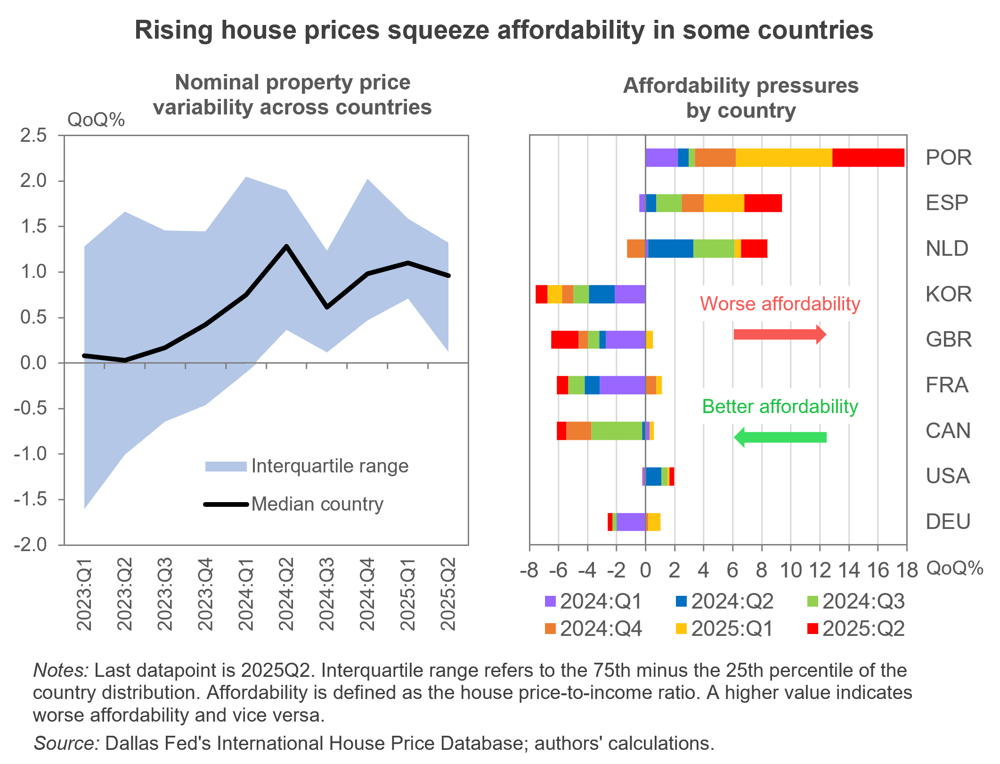

---
output:
  html_document: default
  pdf_document: default
---

```{r setup, include=FALSE}
knitr::opts_chunk$set(echo = FALSE, warning = FALSE, message = FALSE)
```

# Persistent House Price Growth Tightens the Affordability Constraint

<h3 style="color:grey;">
  2025Q3 IHO Global Housing Outlook
</h3>

### Executive Summary

**Global housing markets continued to expand in the second quarter of 2025, with widening disparities in affordability across countries.** While overall affordability remained broadly stable, this aggregate picture conceals significant national differences. Pressures intensified in Spain, Portugal, and the Netherlands, where affordability worsened further, whereas South Korea, the United Kingdom, France, and Canada experienced continued improvements. In addition, real rents rose in most advanced economies, led by Belgium, Canada, and Portugal, highlighting persistent supply constraints in rental markets. Our projections for the U.S. suggest that real property prices will continue to increase in the coming quarter, reflecting ongoing demand resilience.

In response to mounting challenges in housing markets, policy action has intensified across several countries. The United States revised its FHFA “Duty to Serve” framework to improve access to affordable housing finance, while the United Kingdom accelerated efforts to boost housing supply. Meanwhile, Spain and Portugal launched major initiatives aimed at improving affordability and expanding social housing. Overall, housing markets remain resilient, yet they continue to face growing structural pressures stemming from persistent affordability constraints and the impact of ongoing policy adjustments.


<center>

```{r, out.width="70%", out.height="70%"}
#knitr::include_graphics("E:/1_PROJECTS/IHO/IHO_25Q3/Chart_IHO2025Q3.png")  # adapt path
  
``` 
</center>

### Economic Indicators

**The global economy is adapting to a shifting policy landscape: while some trade tensions have eased through new agreements, trade policy uncertainty persists.** <a href="https://www.dallasfed.org/research/international/dgei/gdp" target="_blank">Growth</a> is expected to moderate gradually, with advanced economies expanding modestly and emerging markets maintaining a stronger pace. <a href="https://www.dallasfed.org/research/international/dgei/cpi" target="_blank">Inflation</a> is broadly declining but remains uneven; still elevated in the U.S. and subdued in many other regions. Accordingly, <a href="https://www.dallasfed.org/research/international/dgei/policy" target="_blank">policy rates</a> remain unchanged or continue to be on a downward path for most countries. Headwinds from ongoing uncertainty, protectionist measures, labor constraints, fiscal vulnerabilities, and potential financial corrections can cloud the outlook.

### Global Property Prices and Trends

#### Property price growth persists

Global nominal house prices continue rising by 0.75% quarter-on-quarter (QoQ) in the second quarter of 2025. After the 2021-2022 cycle, house prices have increased steadily at an average pace of 0.6% QoQ. and more in unison. For another quarter, Portugal and Spain show record-high quarterly growth rates of 4.7% and 2.3%, respectively. For Croatia, the growth pace of property prices is also picking up (2.8% QoQ). The U.S. recorded a larger increase of 1.2% QoQ relative to the previous quarter. In turn, quarterly growth rates became negative for the U.K., with a decrease of 0.8% in nominal terms and a more pronounced 1.7% drop in real terms.

*Exuberance analysis*

According to the latest quarterly assessment from the International Housing Observatory, the ongoing growth in house prices has not yet translated into signs of widespread market exuberance. Only Portugal displays indicators consistent with exuberant dynamics in both real house prices and price-to-income ratios. While Croatia and Israel show rapidly accelerating price growth, these patterns dissipate once fundamental factors are taken into account. Moreover, the U.S. continues to show no evidence of exuberance across either metric. Overall, the findings point to growing pressures within housing markets, but bubble-like behavior remains limited at this stage.

*Nowcast analysis*

In this edition of the report, we introduce our nowcast to update our assessment of real property price developments in the U.S. We present the model in an accompanying article (forthcoming) and in a <a href="https://nowcasting.int.housing-observatory.com/nowcasting.html" target="_blank">technical report</a> with details.

After two quarters of  real property price stagnation, the latest quarterly growth surprised to the upside (0.6%). Our nowcast model projects that positive growth will continue into the third quarter of 2025, with real property prices expected to increase by 0.8% QoQ. Nevertheless, the forecast carries an uncertainty range of ±1.2 percentage points, suggesting that different headwinds and tailwinds could either dampen or amplify property price growth.

#### Global affordability growth flattens, masking country heterogeneity

Global affordability stalled this quarter, but the aggregate value hides important country differences. The sustained increase in property prices in recent quarters contrasts with a limited growth in personal income, squeezing affordability for particular countries. The quarterly house price-to-income ratio does not cease to rise in countries such as Portugal (5%), Spain (2.4%), and the Netherlands (1.8%). For the first two countries, it is the 6th and 5th consecutive quarter of worse housing affordability, respectively. Other countries, such as South Korea, the U.K., France, or Canada, have seen a cumulative improvement in affordability where the latest figures were -0.8%, -1.9%, -0.8%, -0.65%, all QoQ. A significant change is observed in Norway, where last quarter the affordability growth was the third worst, and this quarter it is the country with the second-best improvement (1.7%), after the U.K. The U.S. and Germany belong to the group of countries where affordability has changed less.

#### Real rents rise in the majority of countries

In contrast to last quarter, both nominal and real rents rose in most countries between April and June this year. After accounting for the effects of inflation, quarterly real rents increased the most in Belgium (1.8%) and Canada (1%), followed by several countries where rents went up by around 0.5%, notably Portugal. Significant declines were observed in Finland (0.65% QoQ), Ireland (0.5% QoQ), the U.K., and Slovenia (both 0.3% QoQ). For the U.S., real rents climbed moderately by 0.35% QoQ.


### Selected Housing Policies and Regulations

**United States**: The FHFA updated the “Duty to Serve Evaluation Guidance”, which revises how Fannie Mae and Freddie Mac are evaluated for meeting their legal obligation to support housing finance in underserved markets such as manufactured housing, affordable housing preservation, and rural housing. The new guidance streamlines planning and reporting requirements, clarifies evaluation criteria, and adjusts the process for awarding “extra credit” for innovative or impactful activities. The policy is expected to encourage more targeted and effective investment in affordable housing segments, thereby modestly expanding housing supply and affordability in those underserved sectors.

**United Kingdom**: The government announced significant progress under its “New Homes Accelerator” program, confirming that almost 100,000 new homes are being unlocked across England. The initiative focuses on removing planning and regulatory barriers to accelerate delivery, as part of efforts to meet national housing targets and address undersupply. The announcement emphasized collaboration between the central government, local authorities, and private developers to streamline planning, release public land, and invest in supporting infrastructure. The policy aims to increase supply in high-demand areas, stimulate construction activity, and support affordability objectives.

**Spain**: The government established the Housing Advisory Council. It sets out its composition, attributions and functioning: a consultative and technical collegial body designed to ensure participation by relevant stakeholders (representatives of ministries, professional associations, real estate stakeholders, non-profit and social sector entities, and academic experts) in shaping national housing policy. Its role is to advise the State (particularly the Ministry) in the programming of state housing policies, to coordinate with other public administrations, and to provide expert input in the drafting, evaluation and follow-up of housing plans and measures.

Additionally, the government opened a public consultation for the draft of the “Plan Estatal de Vivienda 2026-2030”. The plan will be endowed with €7,000 million in funding and focuses on key priorities: increasing the stock of social, protected and affordable housing, boosting rehabilitation, accessibility and urban renewal, subsidizing aids to reduce the financial burden of paying for housing, and promoting youth emancipation.

**Portugal**: The government and the European Investment Bank (EIB) approved a €1.34 billion financing line aimed at enhancing the public affordable housing sector in Portugal. This funding is designated for the construction and renovation of approximately 12,000 rental units intended for middle-income families. The initiative is part of the national Affordable Housing Program, which seeks to provide long-term rental housing at below-market rates. Municipalities have until 2030 to implement their housing projects under this scheme, benefiting from favorable conditions such as lower interest rates and extended grace periods, thereby making the investment more sustainable. 
