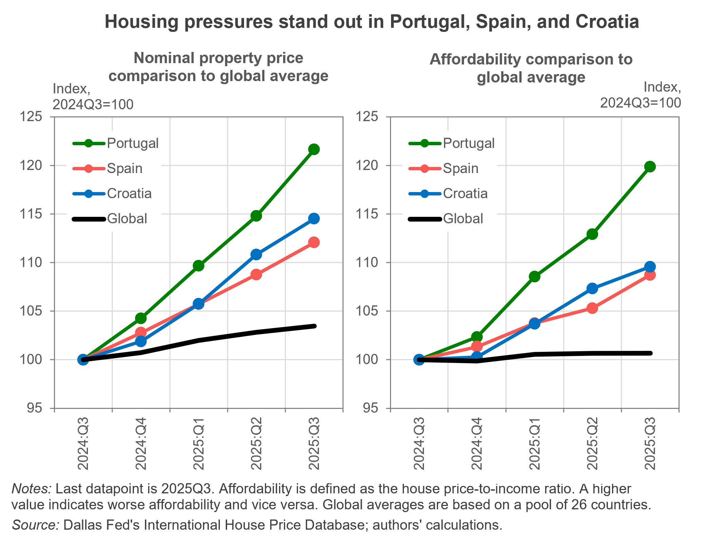

---
output:
  html_document: default
  pdf_document: default
---

```{r setup, include=FALSE}
knitr::opts_chunk$set(echo = FALSE, warning = FALSE, message = FALSE)
```

# Housing Gets Pricier Worldwide, Three Countries Lead the Way

<h3 style="color:grey;">
  2025Q4 IHO Global Housing Outlook
</h3>

### Executive Summary

**Property prices continue to rise in the third quarter of 2025, driven by three countries that push up the world aggregate.** Housing conditions tightened further in Portugal, Spain, the Netherlands, and Croatia, while nominal house price growth moderated relative to the previous quarter and affordability stalled across most other countries. In contrast, affordability in Canada improved markedly, supported by lower nominal house prices and rising disposable income. Nominal rents continued to edge higher, largely reflecting inflation, even as real rent growth slowed in most countries. Our nowcast for U.S. real property price growth points to a moderate deceleration next quarter, partly offsetting the negative growth rate observed in this release.

Against this backdrop, countries facing mounting housing market pressures are announcing and implementing policies aimed at easing supply-side constraints. These measures include support for new construction (notably in the U.S. and the U.K.) and efforts to expand the effective supply of rental housing through risk-sharing mechanisms and the activation of vacant stock (as in Spain and Croatia). Together, these initiatives reflect ongoing efforts to improve affordability and promote housing market stability.


<center>

```{r, out.width="70%", out.height="70%"}
#knitr::include_graphics("E:/1_PROJECTS/IHO/IHO_25Q4/Chart_IHO2025Q4.png")  # adapt path
  
``` 
</center>

### Economic Indicators

**The world economy closed 2025 with resilient but moderate growth, while mounting geopolitical frictions remain the defining headwind heading into this year.** Elevated global uncertainty continues to weigh on <a href="https://www.dallasfed.org/research/international/dgei/gdp" target="_blank">growth</a> prospects across both advanced and emerging economies. Monetary policy paths are increasingly diverging: most <a href="https://www.dallasfed.org/research/international/dgei/policy" target="_blank">central banks</a> in advanced economies remain in easing mode, while in the U.S. sticky <a href="https://www.dallasfed.org/research/international/dgei/cpi" target="_blank">inflation</a> and a cooling labor market complicate monetary policy decisions. At the same time, the geopolitical landscape is undergoing rapid change, pushing uncertainty and risk to historically high levels and making the global environment increasingly difficult to navigate.

### Global Property Prices and Trends

#### Three countries push up the global average

Global nominal house prices rose by 0.6 percent quarter-on-quarter (QoQ) in the third quarter of 2025, but declined by 0.1 percent in real terms. Portugal, Spain, and Croatia again recorded the strongest quarterly growth. Nominal prices increased by 6 percent in Portugal, and by 3.3 percent in Croatia and 3 percent in Spain. For most countries in our sample, nominal house price growth ranged between 1 to 2 percent QoQ. Notably, since 2024Q4, quarterly growth in Portugal, Spain, and Croatia has consistently exceeded 2 percent, often reaching or surpassing 3 percent. By contrast, Canada recorded the weakest performance, with nominal and real house prices falling by 2 percent and 2.9 percent QoQ, respectively. House prices in the U.S. and the U.K. rose moderately, by 0.4 percent and 0.5 percent QoQ, respectively.

*Exuberance analysis*

The latest quarterly assessment by the International Housing Observatory indicates that continued house price increases have not translated into broad-based exuberance across housing markets. Portugal remains the only country exhibiting signs of exuberant behavior in both inflation-adjusted house prices and price-to-income ratios. Croatia continues to experience strong price acceleration, but does not display signs of exuberance once fundamentals are taken into account. In Israel, earlier indications of exuberance have subsided, with current assessments no longer pointing to explosive dynamics. There is likewise no evidence of exuberance in the U.S. under either indicator. Overall, signs of bubble-like behavior remain contained.

*Nowcast analysis*

The increase in U.S. real house prices reported in the previous release has reversed, with growth returning to negative growth (-0.3 percent QoQ). Incorporating this new observation, our nowcast model points to a moderate deceleration in real house prices in the final quarter of the year (-0.1 percent QoQ). Monthly estimates suggest this slowdown would unfold gradually. However, recent volatility has raised the estimated uncertainty to around ±1.7 percentage points, underscoring the heightened uncertainty surrounding end-of-year outcomes.

#### Housing affordability stalls, with important exceptions

Global housing affordability broadly stalled, although affordability pressures intensified further in Portugal, Spain, Croatia, and the Netherlands. Quarterly house-price-to-income ratios increased by 6.1 percent in Portugal, 3.3% percent in Spain, 2 percent in Croatia, and 1.8 percent in the Netherlands. Canada experienced the largest improvement in affordability (-2.7 percent QoQ), driven by lower house prices and stronger disposable income growth. Affordability in the U.S. remained broadly unchanged, while it deteriorated in the U.K. (+0.75 percent QoQ), largely reflecting weaker personal disposable income growth.

#### Real rents partly decelerate

Nominal rents rose sharply in the Netherlands (+2 percent QoQ), Portugal (+1.2 percent QoQ), and Canada (+1.6 percent QoQ), even as property prices declined in the latter. Once adjusted for inflation, quarterly real rents fell in most countries in the sample, with notable declines in Luxembourg (-0.9 percent QoQ), Slovenia (-0.7 percent), and South Africa (-0.7 percent). In the U.S. and the U.K., real rents were broadly flat (+0.1 percent and -0.1 percent QoQ, respectively).


### Selected Housing Policies and Regulations

**United States**: The *Housing for the 21st Century Act* was introduced as a bipartisan federal legislative package aimed at addressing persistent housing affordability challenges and supply constraints. The Act focuses on expanding housing supply, modernizing federal housing programs, and reducing regulatory and financing barriers that limit residential construction and homeownership, particularly for low- and middle-income households. Key provisions include reforms to federal housing finance and development programs, incentives for local governments to relax restrictive zoning and land-use regulations, measures to streamline permitting and construction processes, and updates to housing assistance programs to better align them with current market conditions.

**United Kingdom**: The government launched the *Homes England Investment Roadmap*, which outlines how up to £46 billion in public investment will be deployed through 2026 to accelerate housing delivery and regeneration across England. The roadmap operationalizes the *Homes England Strategic Plan 2025–2030*, setting out investment priorities that include large-scale land development, affordable housing supply, place-based regeneration, and new delivery mechanisms, including a National Housing Bank–style function. Its expected impact is concentrated on the supply side, with the potential to ease structural housing shortages, support construction activity, and enhance market stability over the medium term, particularly in high-demand and regeneration areas.

**Spain**: The government introduced a public, state-backed guarantee scheme to protect landlords against rental payment defaults when leasing to young people and economically vulnerable households. The regulation specifies eligibility criteria, coverage scope, and operational conditions under which the State may compensate landlords for unpaid rent and certain associated costs, provided contracts meet defined legal and administrative requirements. The primary objective is to reduce perceived risk for property owners, thereby encouraging the entry of additional dwellings into the rental market and facilitating access to housing for groups facing affordability constraints. The measure forms part of a broader housing policy strategy aimed at expanding rental supply and improving market stability.

**Croatia**: The government adopted the *Affordable Rental Programme*, which seeks to expand long-term affordable rental housing by activating vacant dwellings, both publicly and privately owned. Government estimates suggest that Croatia has approximately 600,000 vacant housing units, alongside a shortage of around 236,000 affordable units, which the programme aims to address. Under the scheme, tenant rents are capped at 30 percent of household income, while the state compensates landlords up to market rent, ensuring affordability for tenants while providing stable income streams for property owners.
