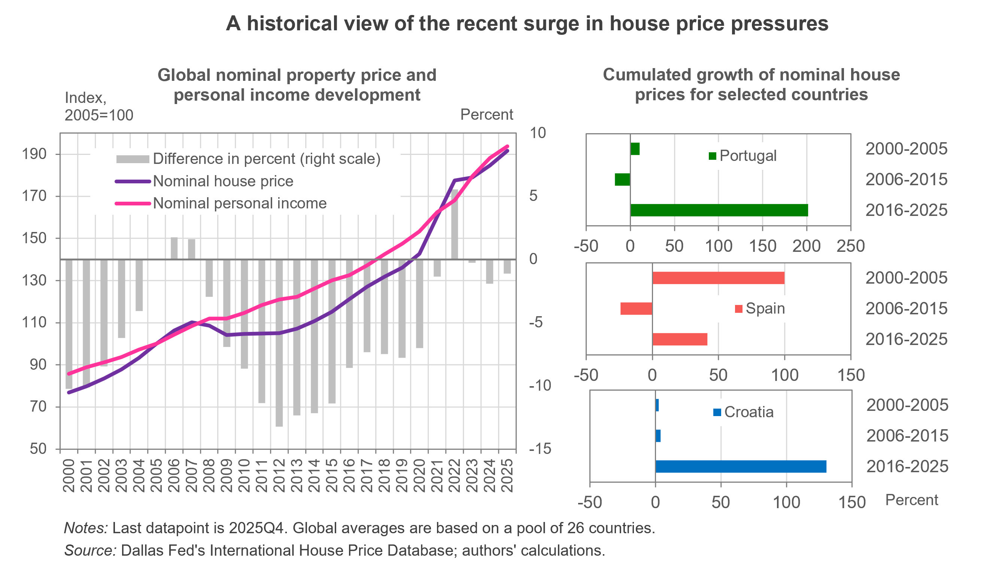
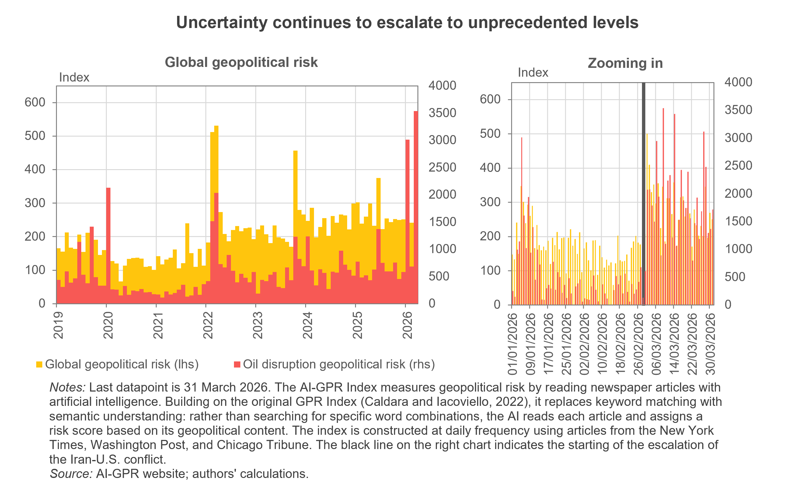

---
output:
  html_document: default
  pdf_document: default
---

```{r setup, include=FALSE}
knitr::opts_chunk$set(echo = FALSE, warning = FALSE, message = FALSE)
```

# A 20-Year Affordability Reset as Price Pressures Persist

<h3 style="color:grey;">
  2026Q1 IHO Global Housing Outlook
</h3>

### Executive Summary

**After two decades of rising prices and incomes, global housing affordability now stands at levels comparable to those of the 2005 peak.** After two decades of rising house prices and incomes, global housing affordability now stands at levels comparable to those of 2005. Over this period, house prices and personal incomes have increased by broadly similar magnitudes, bringing aggregate affordability back to where it was two decades ago. However, this aggregate picture masks significant cross-country differences.

Portugal, Spain, and Croatia continue to experience strong house price growth, with affordability increasingly stretched and housing becoming less accessible for many households. At the same time, nominal rents continue to rise—led by the Netherlands, Canada, and Portugal—pointing to persistent pressures in rental markets.

Looking ahead, our nowcast for United States real property prices points to a more pronounced quarterly contraction of 0.6 percent in the next quarter, following a flat outturn in the latest release and consistent with signs of a deepening decline in recent monthly data.

Policymakers are increasingly turning to structural remedies as housing affordability strains household finances across advanced economies. Recent measures range from deregulation and mortgage reforms in the United States, to fiscal incentives for construction and rental supply in Portugal, and more direct state intervention through rent controls and public housing expansion in Spain and Croatia. Together, these developments point to a broader shift from incremental adjustments toward more systemic reform.


<center>

```{r, out.width="70%", out.height="70%"}
#knitr::include_graphics("E:/1_PROJECTS/IHO/IHO_26Q1/Chart_IHO2026Q1.png")  # adapt path
  
``` 
</center>

### Economic Indicators

**Economic activity at the start of 2026 has proven more resilient than anticipated despite prevailing headwinds, although uncertainty remains elevated.** The ongoing conflict in the Middle East is placing upward pressure on energy prices, raising concerns about potential tensions between <a href="https://www.dallasfed.org/research/international/dgei/gdp" target="_blank">growth</a> and <a href="https://www.dallasfed.org/research/international/dgei/cpi" target="_blank">inflation</a>. In this environment, <a href="https://www.dallasfed.org/research/international/dgei/policy" target="_blank">monetary authorities</a> face an increasingly delicate balancing act, with inflation developments and second-round effects warranting close monitoring. Looking ahead, the interaction between geopolitical risks, energy markets, and policy responses will be central in shaping the near-term macroeconomic outlook. 

<center>
```{r, out.width="70%", out.height="70%"}
#knitr::include_graphics("E:/1_PROJECTS/IHO/IHO_26Q1/Chart_IHO2026Q1_2.png")  # adapt path
  
``` 
</center>


### Global Property Prices and Trends

#### Unprecedented house price surge

Nominal house prices worldwide increased by 0.7 percent quarter-on-quarter (QoQ) in the final quarter of 2025, corresponding to a 3.8 percent annual increase (+0.7 percentage points relative to 2024).

From a historical perspective (see left panel in the first chart above), the post-COVID surge in house prices has been striking, with cumulative increases broadly matching those in personal income over the past 20 years. This is reflected in the recent convergence of house price and income indices, which have moved closely in parallel. This pattern is consistent with a late-cycle phase in global housing markets, suggesting that the post-pandemic expansion likely peaked about—if not before—2025.

Recent price dynamics have nonetheless led to notable buildups in several countries—notably Portugal, Spain, and Croatia—as documented in previous IHO reports. The cumulative house price growth observed over the past decade in these economies is exceptional and points to rising tensions in housing markets (with Spain being the only case with a larger surge in the early 2000s).

The latest data show limited signs of a slowdown. Portugal, Croatia, and Spain recorded the strongest quarterly increases (+5.7 percent, +3.3 percent, and +3.2 percent QoQ, respectively), while Canada registered the largest decline (-2 percent QoQ). House prices in the United Kingdom and the United States remained broadly stable, increasing by 0.9 percent and 0.8 percent QoQ, respectively.


*Exuberance analysis*

The latest quarterly assessment by the International Housing Observatory suggests that, despite continued increases in house prices in some economies, signs of widespread market exuberance remain limited.

Portugal remains the only country exhibiting indications of exuberance across both real house prices and price-to-income ratios. While Croatia continues to record strong price growth, these dynamics are largely explained by underlying fundamentals and do not clearly point to overheating but deserve attention. Spain, while not exhibiting signs of exuberance, is beginning to display some emerging pressures across selected indicators that warrant closer monitoring as well. Similarly, the United States shows no evidence of exuberance under either metric, even though house prices remain somewhat elevated relative to fundamentals.

Overall, risks remain contained, and the absence of broad-based exuberance is consistent with a maturing cycle following a likely peak in 2025.

*Nowcast analysis*

The latest inflation-adjusted United States house price data indicates a flat quarterly outturn for 2025Q4. For the upcoming quarter, our nowcast points to a more marked contraction, with real house prices projected to decline by 0.6 percent QoQ.

High-frequency monthly estimates suggest that the downturn had already intensified by February, although the nowcast remains subject to considerable uncertainty. This projected decline aligns with a broader post-peak leveling off following the 2025 high.


#### Affordability out of reach

Global housing affordability—as measured by the house price to income ratio—tightened marginally, with the house-price-to-income ratio increasing by 0.1 percent QoQ. For 2025 as a whole, affordability deteriorated more noticeably, rising by 0.8 percent, a 2.5 percentage point increase relative to the previous year.

Personal income declined in Portugal and Spain but increased in Croatia, partly easing pressures in the latter. Nevertheless, these countries continue to rank among those with the most strained affordability conditions, with Portugal most affected, followed by Spain and Croatia (+6 percent, +3.5 percent, and +2 percent QoQ, respectively). These developments are consistent with affordability pressures intensifying into a late stage of the housing cycle.

By contrast, affordability improved most in Canada (-2.7 percent QoQ), driven by declining house prices. The United Kingdom also saw an improvement (-0.6 percent QoQ), while affordability in the United States deteriorated slightly (+0.2 percent QoQ).


#### Nominal rents rise

As in the previous quarter, the Netherlands, Canada, and Portugal recorded the strongest growth in nominal rents (+2 percent, +1.5 percent, and +1.3 percent QoQ, respectively).

In the United States, the United Kingdom, and Spain, rents also increased more moderately (+0.8 percent, +0.5 percent, and +0.6 percent QoQ, respectively). The persistence of nominal rent growth, even as real price dynamics soften, suggests a lagged adjustment typical of post-peak housing cycles for some of these countries.

### Selected Housing Policies and Regulations

**United States**: The government introduced Executive Orders combining supply-side and financing reforms to improve affordability. One order aims to reduce regulatory barriers by streamlining environmental reviews, permitting processes, and building requirements, while encouraging state and local governments to adopt less restrictive practices. A second order focuses on expanding access to mortgage credit by easing compliance burdens (especially for community and smaller banks), modernizing appraisal and digital mortgage processes, and revising lending, capital, and supervisory rules to increase competition, lower borrowing costs, and make it easier for creditworthy households (including low- and moderate-income and rural borrowers) to obtain home loans. Together, these measures aim to facilitate construction and improve affordability.

**Portugal**: The Housing Tax Package, approved earlier this year, formalizes the implementation of a coordinated framework of fiscal incentives aimed at increasing housing supply. The package includes a reduced VAT rate (6 percent) on construction and rehabilitation, lower income taxation (around 10 percent) on “moderate rent” housing, enhanced tax deductions for tenants, and capital gains exemptions when reinvesting in rental housing. These measures are complemented by broader incentives for developers, landlords, and investment vehicles. The law also introduces new instruments, such as long-term rental investment contracts with exemptions from transaction and property-related taxes (IMT, IMI, and stamp duty), and requires the government to implement detailed measures within a defined timeframe (up to 180 days). This marks a transition from legislative approval to an operational policy rollout designed to stimulate construction, expand rental supply, and improve affordability.

**Croatia**: The Affordable Housing Act establishes a comprehensive legal framework to address housing affordability by expanding supply, regulating the rental market, and reducing regional disparities in access to housing. As an “umbrella” law aligned with Croatia’s National Housing Policy Plan to 2030, it introduces structural requirements such as allocating a significant share of new multi-apartment developments to affordable rental units (generally around 50 percent), promoting sustainable and modular construction standards, and expanding the role of local and regional governments in housing provision through land allocation, co-financing, and local housing programs. The Act is designed to systematically organize publicly supported housing construction and management, targeting sustained improvements in affordability and availability rather than immediate price reductions.

**Spain**: Spain has implemented a coordinated set of housing policies combining stricter rental regulation, enhanced oversight of short-term rentals, and expanded public housing provision through Casa 47. The government introduced a decree to intervene more directly in the rental market, including rent caps in high-demand areas, restrictions on room-by-room rentals, tighter rules for seasonal leases, and tax incentives aimed at stabilizing rents. Complementing these measures, new regulations impose mandatory annual reporting requirements for short-term rentals, strengthening transparency and control over tourist accommodation and clearly distinguishing it from long-term residential use. In parallel, the government has advanced the rollout of Casa 47, the new state housing entity, which began operations in 2026 by supporting large-scale public housing projects and establishing a system of long-term, income-based affordable rentals that remain permanently within the public housing stock. Taken together, these measures reflect a comprehensive strategy combining market regulation, fiscal incentives, and direct state involvement to address affordability pressures.
